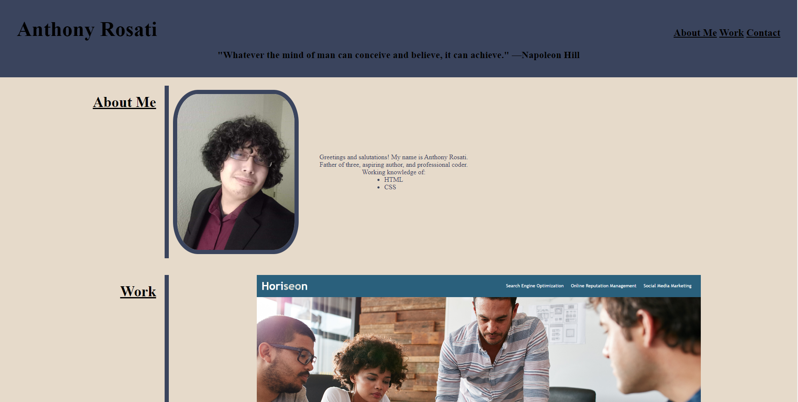

# Professional Portfolio

## [This is a link to my professional portfolio.](https://anthonyrqqq.github.io/professional-portfolio/)

Contained within my portfolio is a link to my most recent completed project, as well as placeholders where future projects will be listed.
  It also lists a few facts about who I am, a profile picture, and the coding languages I have knowledge of. 
  In addition, methods for contact can be found at the bottom of the page.